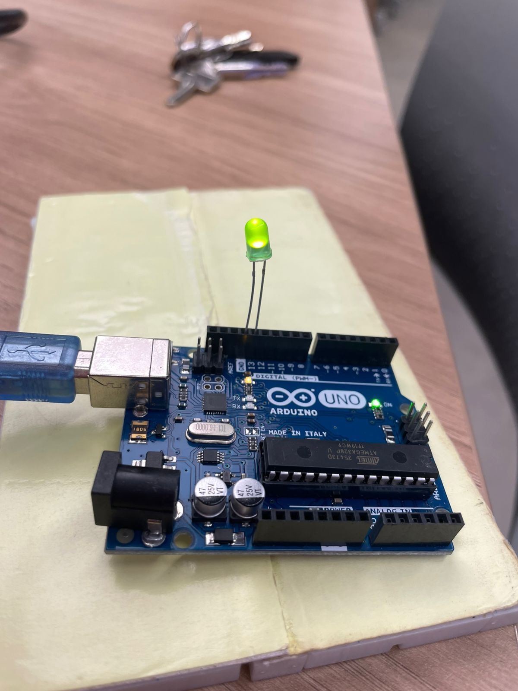

# Código IDE
```cpp 
void setup() {
  // initialize digital pin LED_BUILTIN as an output.
  pinMode(LED_BUILTIN, OUTPUT);
}

// the loop function runs over and over again forever
void loop() {
  digitalWrite(LED_BUILTIN, HIGH);  // turn the LED on (HIGH is the voltage level)
  delay(1000);                      // wait for a second
  digitalWrite(LED_BUILTIN, LOW);   // turn the LED off by making the voltage LOW
  delay(1000);                      // wait for a second
} 
```

# Foto do arduino com Led aceso

<div align="center" width="50%">
 <sub>Figura 2: Led aceso</sub><br>
 
 
 
</div>

# Vídeo do led acendendo e apagando

<video width="600" controls>
  <source src="assets/blink.mp4" type="video/mp4">
</video>