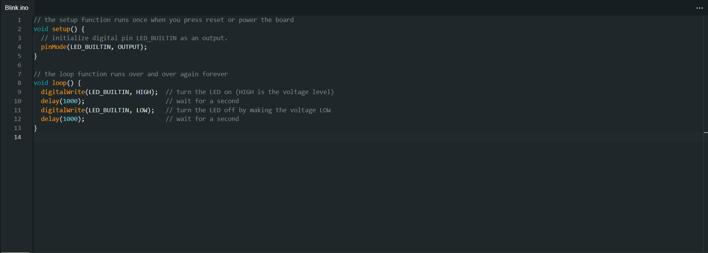
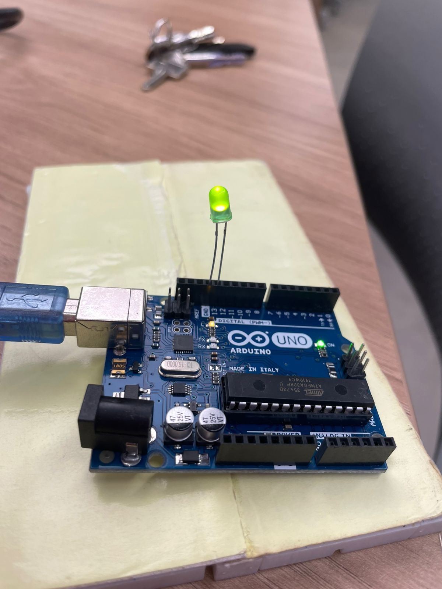

# Código IDE

 Figura 1: Código blink no IDE 
 
 
 

# Foto do arduino com Led aceso

 Figura 2: Led aceso 
 
 
 

# Vídeo do led acendendo e apagando

<video width="600" controls>
  <source src="assets/blink.mp4" type="video/mp4">
</video>